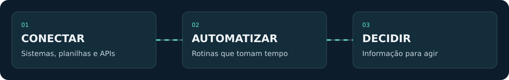
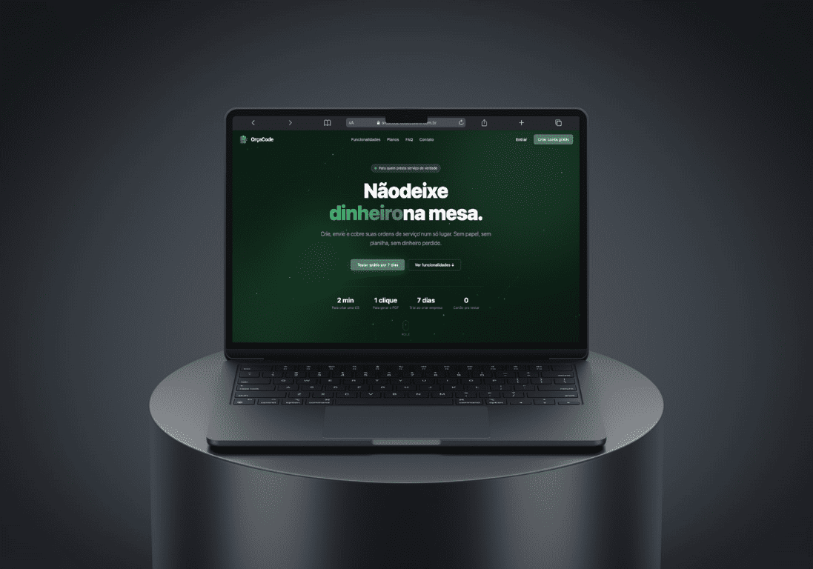
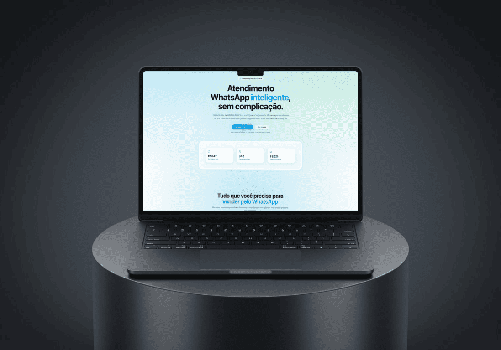
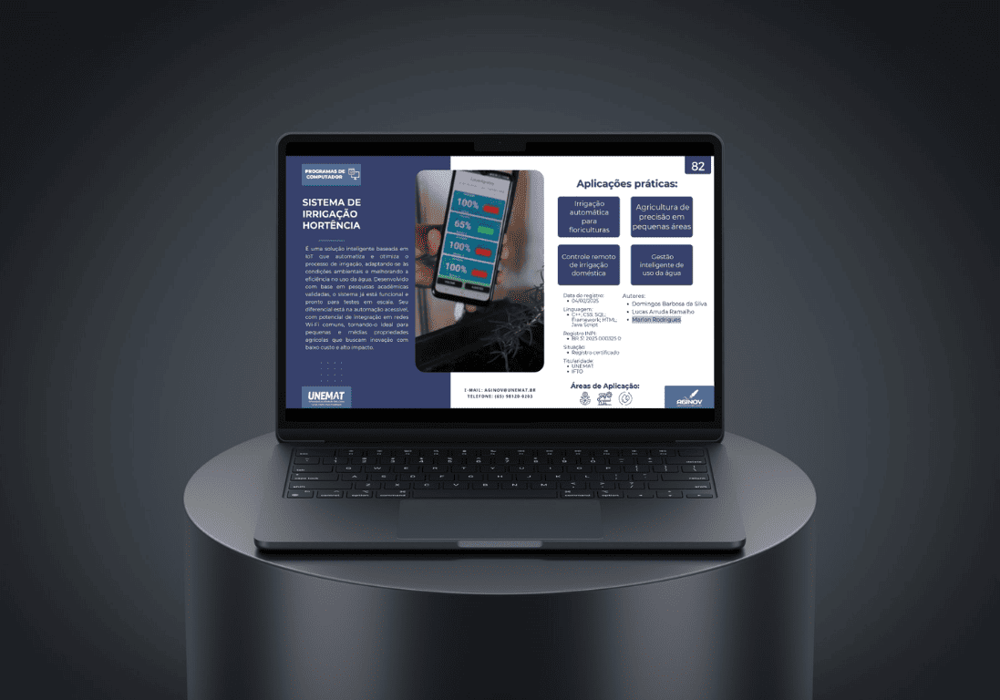
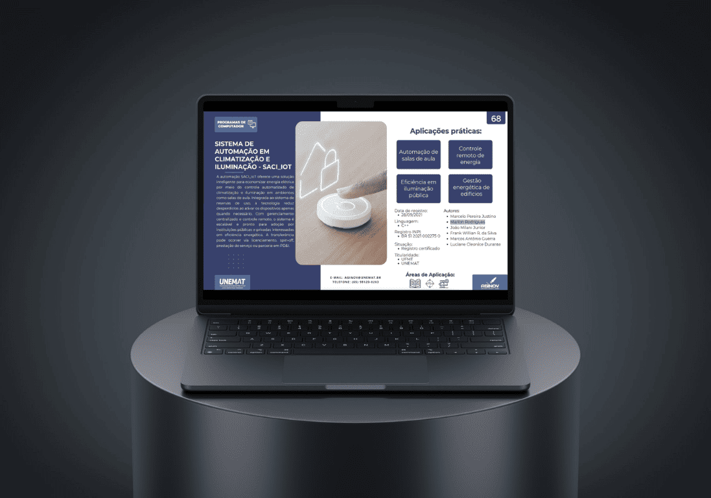

  

  <a href="#onde-sua-operação-trava">Soluções</a> &nbsp;·&nbsp;
  <a href="#produtos-que-você-pode-conhecer-agora">Produtos</a> &nbsp;·&nbsp;
  <a href="#do-software-ao-mundo-físico">Projetos</a> &nbsp;·&nbsp;
  <a href="https://codecommr.com.br/fundador">Minha história</a>

<h1 align="center">Sua empresa cresceu. O trabalho manual foi junto?</h1>

  Relatório atrasado, informação espalhada e gente boa gastando o dia copiando dados. 
  Eu ajudo a tirar esse trabalho do caminho, conectando seus sistemas e automatizando rotinas 
  para sua equipe cuidar da operação e você decidir com mais clareza.

  <a href="https://wa.me/5565984060387"><strong>Quero um diagnóstico gratuito de 15 minutos</strong></a>
  &nbsp;·&nbsp;
  <a href="mailto:mrl.rodrigues2000@gmail.com">E-mail</a>
  &nbsp;·&nbsp;
  <a href="https://codecommr.com.br">CodeComMR</a>

  

Conheça a trajetória e os projetos no <a href="https://codecommr.com.br/fundador">site da CodeComMR</a>.

---

## Onde sua operação trava

### O problema não é só a planilha. É o que fica esperando por ela.

O relatório precisa ficar pronto para você decidir. Mas, antes, alguém precisa buscar os dados em três lugares, conferir os números e corrigir o que veio errado. Quando termina, já tem outra demanda esperando.

**Se a informação depende de alguém parar tudo para montar, sua operação fica esperando também.**

| Isso acontece na sua empresa? | O que podemos mudar |
| :--- | :--- |
| **O cliente chama no WhatsApp e fica esperando.** | Organizar o atendimento com IA, contexto do negócio e encaminhamento para uma pessoa quando necessário. |
| **Você pede um número e recebe: "vou levantar".** | Reunir os indicadores em um painel para consultar sem depender de um relatório montado a cada pedido. |
| **Sua equipe digita a mesma informação em mais de um sistema.** | Conectar as ferramentas para reduzir cópia manual, divergências e retrabalho. |
| **Você só descobre o problema quando ele já virou urgência.** | Dar visibilidade aos indicadores da operação para acompanhar desvios e agir com mais contexto. |
| **Uma pessoa precisa lembrar de cada etapa para o processo andar.** | Organizar o fluxo em um sistema e automatizar as etapas repetitivas. |

Não precisa chegar com uma solução definida. **Me mostre onde o trabalho trava.** A conversa começa pelo que sua equipe faz hoje e pelo que precisa funcionar melhor.

**[Esse problema acontece aqui. Vamos conversar →](https://wa.me/5565984060387?text=Oi%2C%20Marlon!%20Tenho%20um%20processo%20manual%20na%20empresa%20que%20quero%20melhorar.%20Hoje%20o%20gargalo%20%C3%A9%3A%20)**

## Da informação espalhada ao próximo passo

  <picture>
    <source media="(prefers-reduced-motion: reduce)" srcset="./assets/operation-flow-static.svg" />
    
  </picture>

Você traz um processo que toma tempo. Juntos, identificamos onde ele trava e o que precisa mudar. A solução pode ser uma integração, um fluxo automático ou um sistema sob medida, conforme a necessidade da operação.

**Para começar, basta me contar:** o que sua equipe faz manualmente, quais ferramentas usa e o que acontece quando essa tarefa atrasa.

## Quem vai entender o problema e construir a solução

Sou **Marlon Rodrigues**, fundador da **CodeComMR**, com atuação em dados, automação e desenvolvimento de sistemas. No agronegócio, trabalho conectando informações de **John Deere, Farmbox e Agrimanager ERP**. Meu trabalho envolve entender de onde vem o dado, organizar as informações e transformá-las em ferramentas úteis para quem acompanha a operação.

Pela **[CodeComMR (CCMR)](https://codecommr.com.br)**, desenvolvo produtos próprios e soluções sob medida. Meu trabalho inclui entender o processo, construir a solução e cuidar da infraestrutura que a mantém funcionando.

- **Dados e BI:** dashboards, relatórios e indicadores de produção e desempenho.
- **Automação e IA:** workflows com n8n, processamento de documentos e agentes integrados ao WhatsApp.
- **Software e infraestrutura:** aplicações web, APIs, deploy e manutenção em Linux e Docker.

Boa parte dessas entregas está em sistemas privados. Os projetos públicos abaixo mostram outras frentes do meu trabalho.

## Produtos que você pode conhecer agora

<table>
<tr>
<td width="50%" valign="top">

<h3>OrçaCode</h3>

<strong>O orçamento foi aprovado. Por que digitar tudo de novo?</strong>

Orçamentos, ordens de serviço e faturamento conectados, com PDF profissional e avisos de cobrança no WhatsApp.

<a href="https://orcacode.com.br"><strong>Conhecer o OrçaCode →</strong></a>

</td>
<td width="50%" valign="top">

<h3>CodeZaZap</h3>

<strong>Seu próximo cliente está esperando uma resposta?</strong>

Atendimento com IA no WhatsApp, contexto do negócio, CRM e transferência para atendimento humano.

<a href="https://codezazap.com.br"><strong>Conhecer o CodeZaZap →</strong></a>

</td>
</tr>
<tr>
<td width="50%" valign="top">

<h3>CodeFinance</h3>

<strong>Quanto ainda dá para gastar sem comprometer o mês?</strong>

Finanças pessoais com orçamento ajustado à renda e orientação sobre os próximos passos.

<a href="https://codefinance.codecommr.com.br"><strong>Conhecer o CodeFinance →</strong></a>

</td>
<td width="50%" valign="top">
<h3>Seu processo tem outras necessidades?</h3>

Talvez o gargalo esteja entre o ERP, as planilhas e o WhatsApp. Ou numa rotina que nenhuma ferramenta pronta atende bem.

Também desenvolvo sistemas e integrações sob medida. A primeira conversa serve para entender se esse é o caminho para sua empresa.

<a href="https://wa.me/5565984060387?text=Oi%2C%20Marlon!%20Vim%20pelo%20GitHub%20e%20quero%20conversar%20sobre%20um%20processo%20da%20minha%20empresa."><strong>Conversar sobre minha operação →</strong></a>

</td>
</tr>
</table>

## Do software ao mundo físico

<table>
<tr>
<td width="50%" valign="top">

<h3>Hortência · Irrigação</h3>

Sensores de umidade, ESP32 e aplicativo para controlar a irrigação conforme as condições do solo.

</td>
<td width="50%" valign="top">

<h3>SACI · Ambientes inteligentes</h3>

Climatização e iluminação integradas à reserva de salas e à presença, com RFID e controle remoto.

</td>
</tr>
</table>

### Tecnologia dentro da operação agrícola

Planejamento de safra, compras, análise de notas fiscais com IA e integração John Deere fazem parte dos trabalhos apresentados pela CodeComMR. São exemplos de como software, dados e automação podem atuar no mesmo processo.

[Conhecer os projetos e as frentes de atuação →](https://codecommr.com.br/#servicos)

## Código para explorar

| Projeto | O que você encontra | Tecnologias |
| :--- | :--- | :--- |
| **[Temp-Monitor-ESP32](https://github.com/m4rlonr/Temp-Monitor-ESP32)** | Monitoramento de temperatura em gabinetes industriais. | C++, ESP32, IoT |
| **[Table_From_JSON_File](https://github.com/m4rlonr/Table_From_JSON_File)** | Transformação de dados JSON em tabelas interativas. | JavaScript, Bootstrap |
| **[Documentacao_apoio](https://github.com/m4rlonr/Documentacao_apoio)** | Organização e publicação de documentação técnica. | MkDocs, Markdown |
| **[Portfólio](https://github.com/m4rlonr/portfolio)** | Código do meu site pessoal. | Vue.js |

  
<strong>Para quem quer conhecer a parte técnica</strong>

| Área | Tecnologias |
| :--- | :--- |
| **Dados** | SQL Server, PostgreSQL, MySQL, Python, JavaScript |
| **Aplicações web** | TypeScript, Vue.js, Nuxt.js, Node.js, Express, Shadcn UI |
| **Integrações e automação** | APIs REST, n8n, Evolution API, modelos de IA |
| **Infraestrutura** | Linux, Docker, Portainer, VPS, DNS, Git |

  
<strong>Formação e onde me encontrar</strong>

- Formado em **Ciência da Computação pela UNEMAT**.
- Cursando **Engenharia Mecatrônica**.
- Base em **Sapezal, Mato Grosso**, com disponibilidade para projetos remotos.
- Compartilho conteúdo sobre programação no **[YouTube da CodeComMR](https://www.youtube.com/@codecommr)**.
- Você também me encontra no **[LinkedIn](https://www.linkedin.com/in/m4rlonrodrigues/)**.

---

### Vamos olhar para o processo que está tomando seu tempo?

Pode começar com uma mensagem simples: **"Marlon, hoje a gente faz isso manualmente e está tomando tempo demais."** Me conte o processo e onde ele trava. O diagnóstico inicial é gratuito, tem duração de 15 minutos e não exige compromisso. Vamos entender se posso ajudar e qual seria o próximo passo.

**[Quero meu diagnóstico gratuito →](https://wa.me/5565984060387?text=Oi%2C%20Marlon!%20Hoje%20a%20gente%20faz%20isso%20manualmente%20e%20est%C3%A1%20tomando%20tempo%20demais%3A%20)** &nbsp;·&nbsp; [Enviar um e-mail](mailto:mrl.rodrigues2000@gmail.com)
